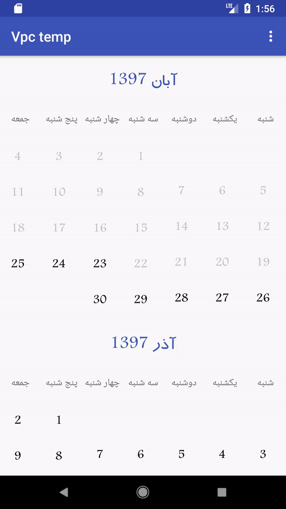

# VericalPersianCalender
انتخاب تاریخ به صورت تکی یا چند تایی


# dependencies

```
allprojects {

	repositories {
	
	
		maven { url "https://jitpack.io" }
		
	}
	
}

dependencies {
        implementation 'com.github.arashAzizimanesh:SignalRStart:1.0.0'
}

```
