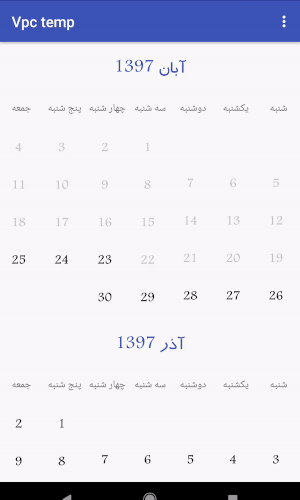
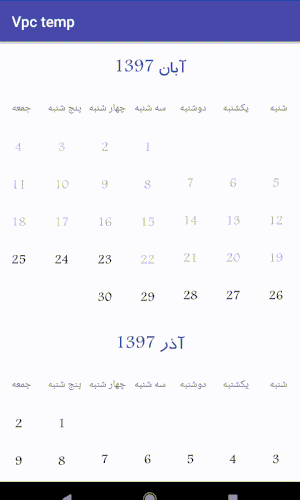

# VericalPersianCalender
انتخاب تاریخ به صورت تکی یا چند تایی


         

# dependencies

```
allprojects {

	repositories {
	
	
		maven { url "https://jitpack.io" }
		
	}
	
}

dependencies {
        implementation 'com.github.arashAzizimanesh:SignalRStart:1.0.0'
}

```


# use

in xml
```

<ir.webcando.vpc.customview.CalenderView
        android:id="@+id/calenderView"
        android:layout_width="match_parent"
        android:layout_height="match_parent"
        app:selectItem="multi"
        app:daysColor="@color/colorPrimary"
        app:selectorColor="@color/colorPrimaryDark"
        app:titleColor="@color/white"
        app:skipMonth="6"></ir.webcando.vpc.customview.CalenderView/>
```

in code
```
calenderView.setFont(font);
        calenderView.setBackgrandSelector(getResources().getColor(R.color.colorPrimary));
        calenderView.setDaysColor(getResources().getColor(R.color.black));
        calenderView.setSelectedType(CalenderView.SELECT_ITEM_SINGLE);
        calenderView.setSkipMonth(6);
        calenderView.initView();

```

get date or dates in code

```
 calenderView.getOnSelectedDate(new OnSelectedDate() {
            @Override
            public void onSelectedSingleDate(String date, String errorMessage) {
                // one date
            }

            @Override
            public void onSelectedMultiDate(List<String> dates, String errorMessage) {
// multu date
            }
        });

```
